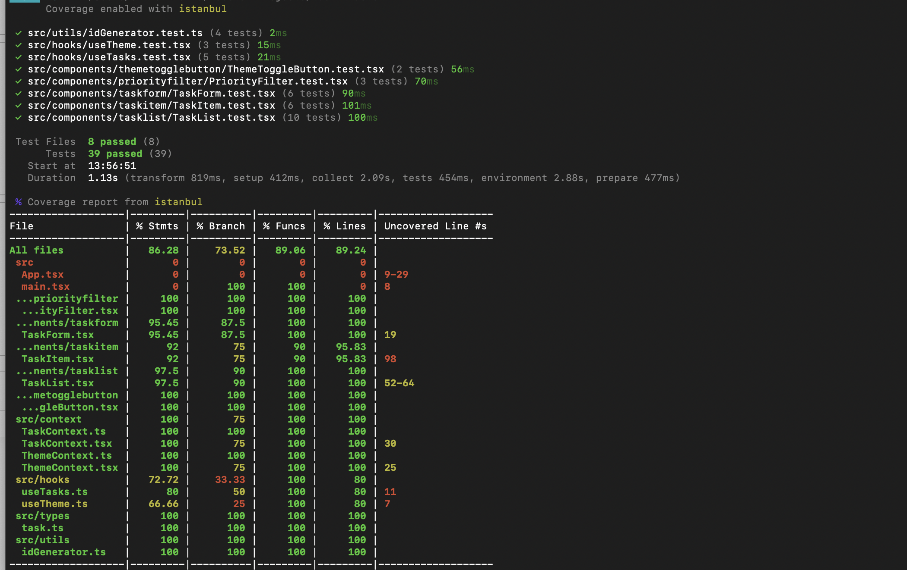
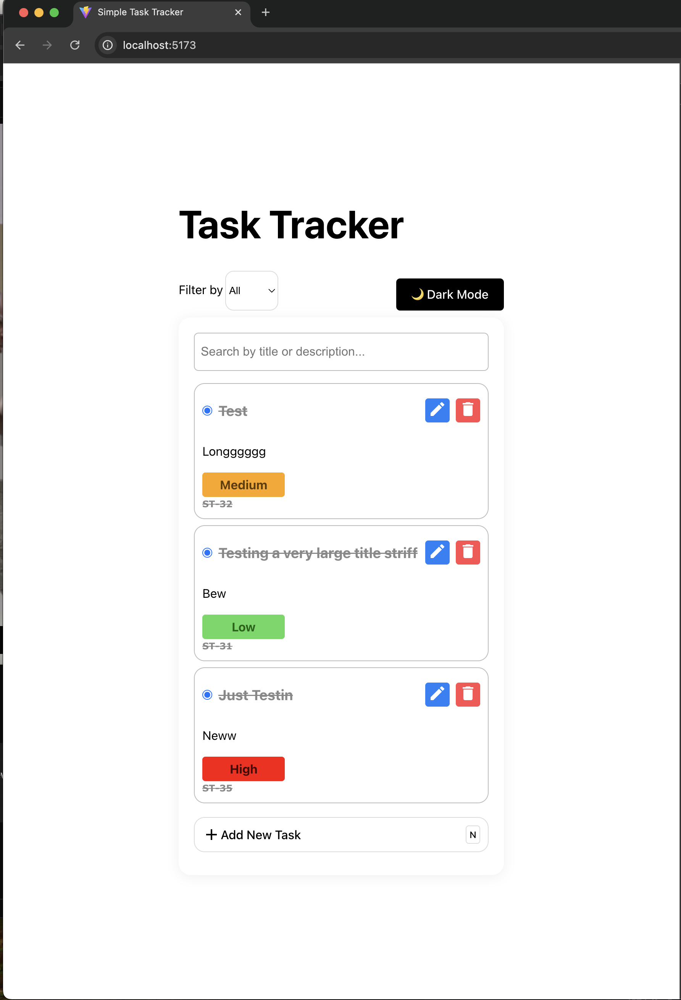
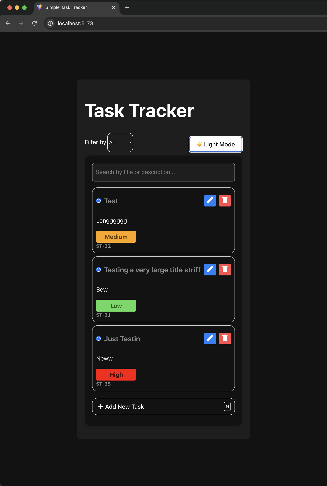
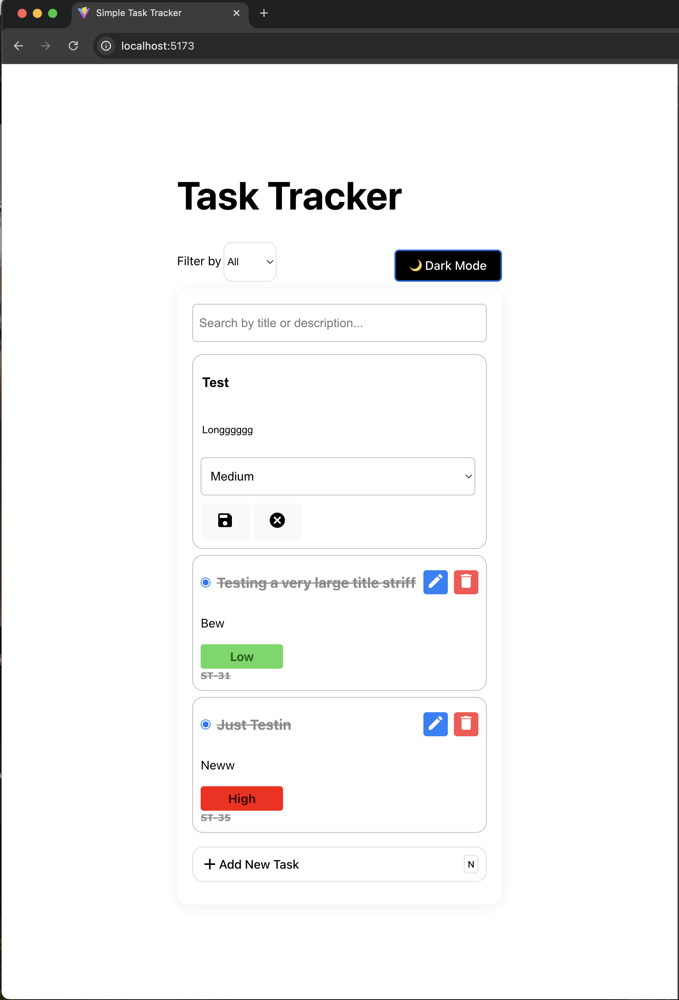

# 📝 Simple Task Tracker (React + TypeScript + Vite)

A **minimal task tracker** built with **React (Vite + TypeScript)**, using the **Context API** for state management.

Features include:
- CRUD tasks (add, delete, update task and mark task completion)
- Filter tasks by priority (**Low, Medium, High**)
- LocalStorage persistence (tasks + theme)
- Sequential task IDs
- Modal-based Task Form
- Drag-and-drop re-ordering for tasks (custom implementation)
- Dark/Light mode toggle using Context + CSS variables
- **Keyboard-friendly**:
  - Press **Enter** to submit new tasks.
  - Press **N** to quickly focus on creating a new task.
- Unit tests with **Vitest + React Testing Library**

---

## 📌 Overview of Approach

- **React + TypeScript (Vite):** Modern, fast setup for the app.
- **Context API:** Used for both `TaskContext` (CRUD + filter state) and `ThemeContext` (light/dark mode).
- **LocalStorage:**
    - Persists tasks between refreshes.
    - Persists last used ID for sequential generation.
    - Persists user’s theme choice (dark/light mode).
- **UI components:**
    - `TaskList`, `TaskItem`, `TaskForm`, `PriorityFilter`, `ThemeToggleButton`.
    - Broken down into small, reusable, and testable functional components.
- **Inline TaskForm:** The add-task form sits directly in the app interface, above the task list.
- **Styling:** CSS Modules per component (`.module.css`) + global theme variables for dark/light mode.
- **Custom Drag-and-Drop:** Implemented without external dependencies — using React state updates and DOM event handlers (`onDragStart`, `onDragOver`, `onDrop`) for lightweight flexibility.
- **Testing:**
    - `Vitest` as the runner.
    - `@testing-library/react` for component tests.
    - LocalStorage calls mocked for deterministic tests.

---

## ⚙️ Running the App Locally

### 1. Clone the repo
```bash
git clone https://github.com/kermakaze/task-tracker
cd task-tracker
```

### 2. Install dependencies
```bash
npm install
```

### 3. Run the dev server
```bash
npm run dev
```
Then open [http://localhost:5173](http://localhost:5173).

### 4. Run tests
```bash
npm run test
```

### 5. Running tests with coverage enabled:
   ```bash
   npm run coverage
```
### Coverage report


## 📸 Screenshots
### Light Mode


### Dark Mode


### Task Creation & List


### Drag and Drop


---

---

## 📂 Code Structure
- **Components:** Each isolated in its own file with a corresponding CSS module.
- **Context:**
  - `TaskContext` for tasks and priority filter state.
  - `ThemeContext` for dark/light mode.
- **Utils:** Encapsulation of logic like sequential ID generation.
- **Styling:**
  - CSS variables for dark/light theming.
  - CSS Modules for component-level styling.

---

## 📖 Notes on State Management

- **Task State:**  
  Managed in `TaskContext` using `useState` + persisted to `localStorage`.  
  Provides `addTask`, `updateTask`, `deleteTask`, `setFilter`, `reorderTasks`.

- **Filter State:**  
  Selecting a priority updates the context filter → dynamically filters tasks in `TaskList`.

- **Theme State:**  
  Managed with `ThemeContext`.  
  Provides `theme`, `toggleTheme`.  
  Uses `document.body[data-theme]` and CSS variables for styling.  
  Persists choice in `localStorage`.

---

## ✅ Possible Future Improvements
- Due dates + sorting by deadline
- Kanban-style board (drag tasks between priority “columns”)
- User authentication + remote storage


---
